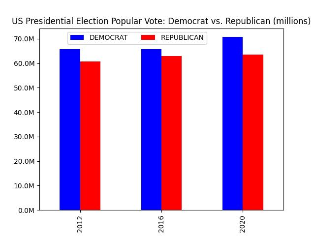

# PRESIDENTIAL Election Anaylsis (2020-    )
by: Lee Prevost, 11/7/2024

I did a very quick analysis using data sourced from: [Harvard Dataverse sourced via MIT Election Lab](https://dataverse.harvard.edu/dataset.xhtml?persistentId=doi:10.7910/DVN/VOQCHQ)

Used python pandas to read presidential election data from 2020.   Created margin column that shows vote margins as a percent of total vote such that:
(pres_pt.REPUBLICAN - pres_pt.DEMOCRAT)/pres_pt.TOTAL
negative values - county voted for democrat majority vote
positive values -- county voted for republican majority vote

Log bins: [6.60000000e+01 6.04791979e+02 5.54202026e+03 5.07843849e+04, 4.65363464e+05 4.26436500e+06] (vote counts for 2016,2020)

Labels:
- xs
- s
- m
- l
- xl

I do see some oddities at county levels particuarly in Georgia in 2020 in larger/suburban counties with large shifts to the left and in Texas in small/rural counties with large shifts to right.

But, I also can't get to the 80M+ votes Zero Hedge chart shows for Democrats in 2020.  Am I missing something?

