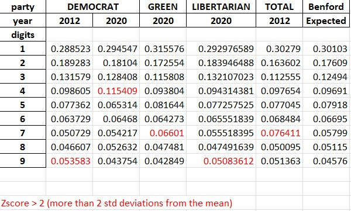
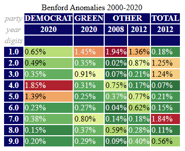

# Closer Analysis of Benford at Digit Level
**_Averages can hide the truth in a dataset._**   My next step was to isolate specific deviations from Benford expected at the digit and vote count levels.  To do this, I flagged all election years and all candidate votes whose digit percent error was more than 2 standard deviations (prob ~ 2%) from the mean.

The [anomalous years](/tabs/benford_anomalous_years.xlsx) and candidate votes are:

.  

Even while the means of all digits seem low, these years and digit errors are fairly substantial relative to all the rest.

Digit 4 and 5 on Democrat Vote 2020 really jump out at me.

The actual percent error for the Democrat vote in 2020:

Consider the weight of this Benford error rate analysis (2000-2020):
1) This century, there have been only 5 vote counts where the error rate exceeds two standard deviations from the mean.
2) Of the two major parties, the Democrat vote count is the only party whose votes have exceeded two standard deviations from the mean. That happened in 2012 and 2020.
3) The election year 2020 had the most anomalies (3 of the 5).
4) The anomalous votes for Democrats in 2020 were in counties where the digits shifted to 4 or from 5 in 2016.

Next step, closer inspection of those counties whose votes shifted to 4 or from 5 in 2020.

I'll call this group the Benford Anomalous Group (BAG):
[BAG](../tabs/anom_20_dem.csv)
