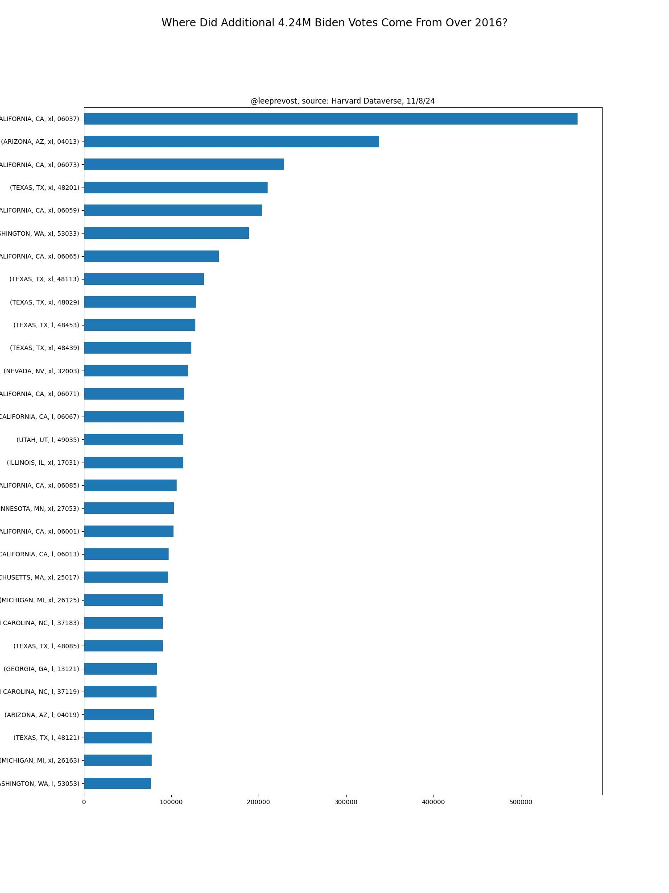
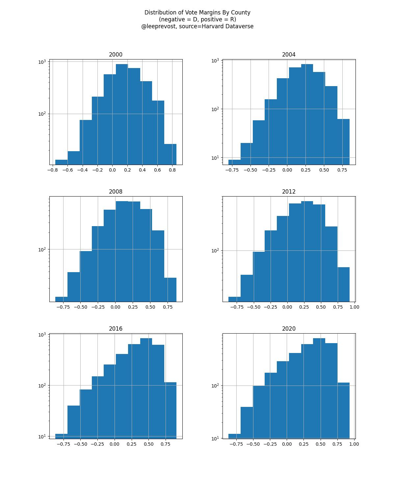

Very specifically, I wanted to focus on where the incremental votes for Joe Biden came from over the Democrat vote counts
in the 2016 election, by county.   The raw counts for those vote diffs are in: [diff_16_20.csv](../tabs/diff_16_20.csv).

The top 30 counties [whose votes shifted towards Biden] include 4.24M incremental votes over the 2016 election.

## Distribution of Margins By County
In order to analyze the outliers, I studied the vote distributions.  Looking at what looks to be fairly normal distribution of margins across all
3,156 counties.    This is a frequency count, not magnitude showing that most of US counties are steadily shifting right but
most of those are small.

Shifting right -- positive
Shifting left -- negative

But, no smoking gun here!